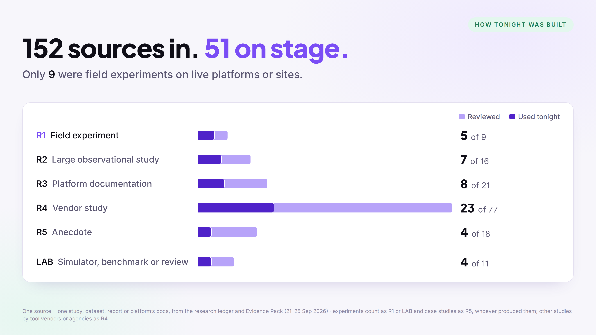

# The Invisible Funnel — evidence pack

**What actually works in AI visibility, and what the evidence says doesn't.**
Companion to the talk by Anton Andrusenko at SaaS Marketers Connect, DeepL, Berlin, 30 September 2026.

**Download:** [Full pack (PDF)](The-Invisible-Funnel-evidence-pack.pdf) · [Six-questions checklist (PDF, 2 pages)](Six-questions-checklist.pdf) · [All sources (CSV)](sources.csv)

Every number from the talk is here, with where it came from, how strong it is and what it doesn't show. The research cut-off was 21 September 2026, and the figures were checked against their sources by 23 September. Changes after the cut-off were checked on 25 September (section 5). I didn't author the studies cited: I collected them, checked them against their sources and graded them. The one exception is a small audit I ran myself, clearly marked as mine.

**Contents**

1. [How the evidence was graded](#1-how-the-evidence-was-graded)
2. [The talk, slide by slide](#2-the-talk-slide-by-slide)
3. [My audit: how it was run](#3-my-audit-how-it-was-run)
4. [The checklist: six questions, definitions and a test you can run](#4-the-checklist)
5. [What changed after the cut-off](#5-what-changed-after-the-cut-off-checked-25-sep-2026)
6. [Numbers I didn't use, and why](#6-numbers-i-didnt-use-and-why)
7. [All 51 sources, by rung](#7-all-51-sources-by-rung)
8. [Disclosure, corrections, how to cite](#8-disclosure-corrections-how-to-cite)

---

## 1. How the evidence was graded

Every number gets a rung, and the rung says how much weight it can carry.

| Rung | What it is | What it can tell you |
|---|---|---|
| **R1** · Field experiment | A controlled test on live platforms or live sites | Cause, in that setting |
| **R2** · Large observational study | Independent audits, panels, peer-reviewed surveys | Patterns, not causes |
| **R3** · Platform documentation | What Google, OpenAI, Anthropic or Microsoft say about their own systems | How it's meant to work |
| **R4** · Vendor study | Research by a company that sells tools or services in this market | Direction, from an interested party |
| **R5** · Anecdote or single case | One site, one firm, one practitioner's observation | That something can happen |
| **LAB** · Simulator, benchmark or academic review | Controlled or synthesised, but not a production system | A mechanism, not your platform |

Experiments count as R1 or LAB by design, whoever ran them. Case studies count as R5. Other studies by tool vendors or agencies count as R4, including Semrush's.

| Rung | Reviewed | In the approved-claims pack | Cited in the talk |
|---|---|---|---|
| R1 · Field experiment | 9 | 7 | **5** |
| R2 · Large observational study | 16 | 11 | **7** |
| R3 · Platform documentation | 21 | 15 | **8** |
| R4 · Vendor study | 77 | 57 | **23** |
| R5 · Anecdote or single case | 18 | 9 | **4** |
| LAB · Simulator, benchmark or review | 11 | 5 | **4** |
| **Total** | **152** | **104** | **51** |

One source means one study, dataset, report, or one platform's documentation. Of the 152 reviewed, 104 made it into the approved-claims pack behind the talk, and 51 are cited in the talk itself. Another 11, not counted in the 152, were set aside because they couldn't be verified in time. Only 9 of the 152 were field experiments (controlled or quasi-controlled tests on live platforms or sites).

A review of 45 GEO studies found no technique with a stable, cross-platform causal effect on organic discoverability ([Martinez, 2026](https://arxiv.org/html/2607.14035v1), LAB). That is absence of evidence, not evidence of absence.

---

## 2. The talk, slide by slide

The slides are grouped by act. Audit numbers carry the audit caption. Where a slide makes no factual claim, that's said too.

### Prologue

**The evaluation journey starts inside AI.** Sarah is a composite: an HR lead choosing an HR system for a 150-person company in Germany. Her questions are real; they are the ones used in my audit (section 3).

**She never clicked.** In a last-click model, Sarah's purchase is recorded as google / organic, a branded search. The place where the decision formed doesn't show up in the report.

**Every number tonight has a rung.** See section 1.

**152 sources in. 51 on stage.** See section 1.

### Act 1 · The gap

**The buyer sees AI. Analytics sees the arrival.**

- **94%** of B2B buyers report using AI in their buying process. [Forrester, State of Business Buying 2026](https://www.forrester.com/blogs/state-of-business-buying-2026) (~18,000 buyers, R2) and [6sense 2025](https://6sense.com/science-of-b2b/buyer-experience-report-2025/) (~4,000 buyers, 94% used LLMs, R4). The two surveys word the question differently.
- *Hypothesis:* buyers use AI mainly to compare and narrow a list, not to discover vendors. In the 6sense survey, 85% already knew the vendors they evaluated.
- **~1%** of website visits arrive from AI assistants. [Conductor 2026 benchmarks](https://www.conductor.com/academy/aeo-geo-benchmarks-report/): 13,770 domains, 3.3 bn sessions, May–Sep 2025 (R4). This is 2025 data, and AI referrals are growing fast from a small base.
- **Reach, company-reported (R3):**
    - AI Overviews: 2.5 bn+ monthly users ([Google I/O, 19 May 2026](https://blog.google/innovation-and-ai/sundar-pichai-io-2026/)).
    - ChatGPT: more than 1 bn weekly users ([OpenAI, Aug 2026](https://openai.com/index/expanding-access-to-ai-with-chatgpt-ads/)).
- **Germany:** 37% of people aged 14+ use AI tools at least weekly ([ARD/ZDF-Medienstudie 2026](https://t3n.de/news/ard-zdf-medienstudie-2026-ki-nutzung-1765059/), 2,462 respondents, R2).
- **What it doesn't show:**
    - AI Overviews' count is people shown a summary, not people who chose to use AI.
    - Surveys and traffic data describe different populations, so don't multiply them.
    - Weekly and monthly user counts are different units, so never add them up.

**We see the edges, not the middle.**

- **−39.8%** outbound organic clicks when an AI Overview appeared. [Agarwal & Sen](https://papers.ssrn.com/sol3/papers.cfm?abstract_id=6513059): randomised field experiment, N = 1,065, US, Google, Jan–Feb 2026 (R1, not yet peer reviewed). The effect is conditional: it applies only when an AI Overview appears.
- **8% vs 15%**: share of Google searches that led to a click on a traditional result, with and without an AI summary ([Pew Research Center](https://www.pewresearch.org/short-reads/2025/07/22/google-users-are-less-likely-to-click-on-links-when-an-ai-summary-appears-in-the-results/), 900 US adults, Mar 2025, R2).
- **−18.8 percentage points** click-through under an AI-Mode-only experience ([Wang et al.](https://arxiv.org/abs/2608.18352), preregistered, N = 1,100, R1).
- **What it doesn't show:**
    - Any effect on ChatGPT or Perplexity: no experiment covers them.
    - An "all searches" figure: none of these studies publishes one.
    - One number measured several times: these are different treatments with different results.

**Four meanings hide inside "visibility".**

| Meaning | What happened |
|---|---|
| **Found** | Your page entered the set of candidates. |
| **Cited** | The answer links to the source. |
| **Recommended** | The answer endorses your product. |
| **Chosen** | The buyer picks it. |

These outcomes are related, but they aren't a chain. When a dashboard says "AI visibility", ask which of the four it means.

### Act 2 · How AI picks

**One question. Many queries.**

- Google documents that AI Mode may use "query fan-out": issuing several related searches for one question ([Google Search Central](https://developers.google.com/search/docs/appearance/ai-features), R3).
- **10.7** sub-queries per prompt, and **95%** of them had zero measured search volume. [Seer Interactive](https://www.seerinteractive.com/insights/gemini-3-query-fan-outs-research) read the grounding metadata of the Gemini 3 API: 501 prompts, Nov 2025 (R4). That is one API at one point in time.
- Not every system searches every time. In donated real conversations, ChatGPT used web search for 14% of prompts ([Amani et al., Sep 2026](https://arxiv.org/abs/2609.19244), R2).
- **Takeaway:** answer the detailed questions, not only the head terms.

**Your site is one voice in the answer.**

- **11.6%** of ChatGPT's citations went to the recommended SaaS tool's own site. [DerivateX](https://natlawreview.com/press-releases/study-chatgpt-cites-recommended-saas-tools-own-site-just-12-time): 40 B2B SaaS categories × 10 runs, ChatGPT, Jun 2026 (R4). The study used one prompt per category.
- "Best X" lists made up **35%** of citations in SaaS answers in one dataset of about 1 million citations ([Wix AI Search Lab with Peec AI data](https://www.wix.com/studio/ai-search-lab/research/content-types-most-cited-by-llms), Mar 2026, R4). Page-type rankings shift when models update.
- **What it doesn't show:** that your own site doesn't matter. It's where facts get corrected.

**German prompts don't guarantee German sources.**

- Share of German-language sources in answers to German prompts: Google AI Overviews **89.8%**, Copilot **75.9%**, ChatGPT **66.0%**, Grok **49.3%**. [Temso, Lost in Translation](https://www.temso.ai/data/-Lost-in-Translation-How-AI-Models-Handle-Local-Language-Sources): 7.06 M citations, early 2026 (R4, a vendor study, so treat it as directional).

**In my audit**, Vendor A's presence didn't change with the language of the question. The sources did:

| Share of cited domains ending in .de | German questions | English questions |
|---|---|---|
| Google AI Mode | **54%** | **15%** |
| ChatGPT | **50%** | **35%** |

The table measures .de domains, not the language of the page, so it's a different measure from Temso's.

> *My audit · 1 category, 1 brand · 10 questions × DE/EN · ChatGPT + Google AI Mode · 62 answers, signed-in sessions · 23 Sep 2026 · exploratory, not a trend*

**Takeaway:** keep separate German and English baselines, and don't average them.

### Act 3 · What holds up?

**The bet:** which move has the strongest experimental support? A, statistics and quotes · B, schema · C, llms.txt · D, titles and structure · E, third-party mentions.

**The famous +40% was measured after the page was found.**
[Aggarwal et al., KDD 2024](https://arxiv.org/abs/2311.09735) (LAB). The researchers took five pages that search had already found, rewrote one of them, and gave all five to GPT-3.5. They then measured the rewritten page's share of the words in the answer, adjusted for position. That share went from 19.3 to 27.2, which is +40%. Whether search would find the rewritten page was never tested. The result is real inside its frame.

**Strongest support? D, narrowly, and at one stage.**

| Move | Best evidence | Result |
|---|---|---|
| **A** · Statistics & quotes | [C-SEO Bench](https://arxiv.org/abs/2506.11097), NeurIPS 2025 (LAB): 1,915 queries, 4 models | The +40% came from the GEO simulator (above). In this benchmark, across all methods tested, 3 significant wins in 54; adding statistics lowered rankings in 19 of 24 settings |
| **B** · Schema | [Ahrefs matched test](https://ahrefs.com/blog/schema-ai-citations/) (R1 by design): 1,885 pages, each against 3 controls | No citation uplift on any platform (−4.6% on AI Overviews). Keep schema for rich results. |
| **C** · llms.txt | [Ahrefs server logs](https://ppc.land/llms-txt-adoption-rises-8-8x-but-97-of-files-get-zero-ai-requests/) (R4): 137,000 domains, May 2026 | 97% of files got no requests in a month; AI-search retrieval bots made 1.1% of requests. [Google](https://developers.google.com/search/docs/appearance/ai-features) says you don't need AI text files like llms.txt to appear in Search, AI features included; that statement is about Google only. |
| **D** · Titles & structure | [SAGEO Arena](https://arxiv.org/abs/2602.12187), KDD 2026 (LAB) | +22% at retrieval, −17% at reranking, +2% at citation: positive at one stage only |
| **E** · Third-party mentions | [Ahrefs, 75,000 brands](https://ahrefs.com/blog/ai-brand-visibility-correlations) (R4) | Brand mentions correlate with AI visibility 3× more than backlinks (0.66 vs 0.22). Correlation, no experiment. |

**Bottom line:** no tactic is proven across sites and platforms. The live field tests of content changes so far are single sites or one vendor's matched sample. So invest in the fundamentals, and test your own changes.

### Act 4 · What actually works

**Boring beats magical.** There are four levers: be retrievable, be explicit and correct, be present where machines read, and test. This is my framework: practical priorities, not a tested combined recipe.

**Be retrievable.**

- **Access.** Let the search bots in. [OpenAI](https://developers.openai.com/api/docs/bots): sites opted out of OAI-SearchBot aren't shown in ChatGPT search answers. Anthropic documents Claude-SearchBot ([Anthropic](https://support.claude.com/en/articles/8896518)). Blocking training bots doesn't remove you from answers; blocking search bots does.
- **Rendering.** ChatGPT's and Claude's live fetchers don't run JavaScript ([RESONEO test](https://think.resoneo.com/sentinel/geo-llm-crawler-report.html), R5; Anthropic docs, R3). Google's index does ([Google Search Central](https://developers.google.com/search/docs/appearance/ai-features), R3). Keep key content in the HTML.
- **Answer first.** 44% of ChatGPT citations came from the first 30% of a page's text ([Indig](https://www.growth-memo.com/p/the-science-of-how-ai-pays-attention), 18,012 citations, R4).
- In one vendor dataset, when search found the brand's own site, the brand was named **40–49 points** more often. When it didn't, the brand was named in **3–4%** of answers ([Tannenbaum, arXiv:2609.23162](https://arxiv.org/abs/2609.23162), 34,960 observations, R4). This is observational: correlation, not cause.
- **What it doesn't show:** that being retrievable gets you recommended. It opens the door, nothing more.

**In most AI answers, your page is a title and a passage.** This describes default answers.

- **ChatGPT.** [RESONEO's capture of ChatGPT](https://think.resoneo.com/chatgpt-retrieval/) (1,249 answers, Jul–Aug 2026, R4):
    - ChatGPT saw about **200 characters** per result, usually starting at the H1.
    - Nine quick answers in ten opened no page, and 1.2% of retrieved pages were opened.
    - An opened page is read whole, with its structured data (JSON-LD) removed.
    - As an illustration from that one capture (August 2026): listed 100% → attached to the answer 12.4% → lead citation 8.2% → opened by the model 1.2%.
- **Gemini.** About **2,000 words** of grounding per question, shared by all the sources ([DEJAN](https://dejan.ai/blog/how-big-are-googles-grounding-chunks/), 7,060 queries, Gemini API, Dec 2025, R4).
- **Reasoning modes.** OpenAI's docs say reasoning models can open pages (R3), so in Thinking, Deep Research or agent modes more pages get read in full. There, the whole page has to be readable.
- **Limits:** each capture covers one product in one mode, measured before GPT-6. **Takeaway:** write the title and first two lines as the answer.

**Be explicit, or AI borrows someone else's numbers.**

- **In my audit:**
    - Where Vendor A's pages are explicit (the DATEV integration), no answer got it wrong.
    - Where they're silent (pricing), six answers used third-party prices, and two credited those prices to the vendor.
    - Of 81 checkable claims, 52 were confirmed and 3 were wrong or outdated. The other 26 couldn't be confirmed from the vendor's own pages, which doesn't make them wrong.

    > *My audit · 1 category, 1 brand · 10 questions × DE/EN · ChatGPT + Google AI Mode · 62 answers, signed-in sessions · 23 Sep 2026 · exploratory, not a trend*

- **Other evidence:**
    - How well a page matches the question was the strongest page-level signal, about three times the next ([Discovered Labs](https://discoveredlabs.com/research/what-drives-ai-citations), 2 M citations, agency data, R4).
    - In a controlled test, adding product USPs to pages raised LLM traffic **18%** ([SearchPilot × Omio](https://www.searchpilot.com/resources/blog/is-geo-working-how-to-get-beyond-prompt-tracking), R1, travel).
    - **11%** of 98,020 claims in AI Overviews weren't supported by the page cited ([Xu et al.](https://arxiv.org/html/2605.14021v1), R2).
    - 75% of cited pages had been updated within the past year ([Seer Interactive](https://www.seerinteractive.com/insights/study-content-recencys-impact-on-ai-visibility-in-2026), R4). The study looked only at cited pages, so updating is a lever to test, not a proven cause.
- **What it doesn't show:** that publishing your prices makes AI quote them. That is a test to run.

**Be present where the machine reads.** In my audit, the two platforms read different webs:

| | ChatGPT (36 answers) | Google AI Mode (26 answers) |
|---|---|---|
| Answers citing Vendor A's own site | 36 of 36 | 15 of 26 |
| Vendor A's own site, share of cited domains | **22%** | **8%** |
| Largest other group | Competitors' sites **63%** | Blogs, comparison sites & directories **38%** |

- The two platforms shared 19% of the domains they cited.
- YouTube was 2% of cited domains, and Reddit and other communities about 1%. Both are top sources in US datasets. US shares didn't hold in this audit.

> *My audit · 1 category, 1 brand · 10 questions × DE/EN · ChatGPT + Google AI Mode · 62 answers, signed-in sessions · 23 Sep 2026 · exploratory, not a trend*

**AI visibility travels with off-site mentions.**

- Brand mentions on the web correlate with AI visibility at **0.66**, backlinks at **0.22** ([Ahrefs, 75,000 brands](https://ahrefs.com/blog/ai-brand-visibility-correlations), R4).
- In one study of consumer brands, the strongest predictor of being recommended was how much people search for the brand (β 1.06). Ad spend came out negative (−0.14) ([Malthouse et al.](https://arxiv.org/abs/2609.16304), 2,400 lists, 6 models, exploratory, R2). "Ad spend" there means general advertising, not ads inside AI answers.
- Review volume explains **under 2%** of AI visibility ([G2 / Indig](https://learn.g2.com/do-more-g2-reviews-mean-more-ai-visibility), published by G2, R4).
- In mid-August 2026, ChatGPT's Reddit citations fell **73–97%** across three trackers ([Qwairy](https://www.qwairy.co/blog/chatgpt-reddit-citations-collapse-august-2026), Otterly, [Petra Labs via Inc.](https://www.inc.com/victoria-salves/chatgpt-suddenly-cut-reddit-citations-by-81-percent-new-report-found/91394126), R4). Platforms change what they read faster than you can change a content plan.
- **What it doesn't show:** cause. Big brands have everything at once, so a common cause and reverse causation are both plausible. No one has published a controlled test of any off-site lever.

**Test it like CRO, not like SEO.**

- **Omio (Berlin).** Omio added "key takeaways" blocks to destination pages and compared them with control pages. LLM traffic rose, but Google organic traffic was projected at **−6.5%**, so Omio didn't ship the change ([SearchPilot × Omio](https://www.searchpilot.com/resources/blog/is-geo-working-how-to-get-beyond-prompt-tracking), R1). A GEO win can hide a Google loss.
- **Google still dominates.** Google sends about **190×** more traffic than ChatGPT, in one vendor's cohort of ~76,000 sites ([Ahrefs](https://ahrefs.com/blog/chatgpt-has-12-percent-of-googles-search-volume/), R4). That's why every test needs a Google guardrail.
- **Glasp.** The best-controlled single-site study found **×1.8** ChatGPT referrals, but its placebo test failed (p = 0.16). The authors call the result suggestive, not conclusive ([Watanabe & Nakayashiki](https://arxiv.org/abs/2606.04362)).
- **No B2B test yet.** No B2B team has published a controlled test. A design that works at B2B scale is in section 4.

### Act 5 · What can we measure?

**What you can see today: reach, not revenue.**

| Tool | Shows | Doesn't show |
|---|---|---|
| **GA4** | A built-in **AI Assistant** channel since 13 May 2026 ([Google](https://support.google.com/analytics/answer/9164320); not retroactive) | AI Overviews and AI Mode clicks, which arrive as google / organic; apps that send no referrer |
| **Search Console** | Generative AI report: impressions only ([Google](https://support.google.com/webmasters/answer/16984139); still true on 24 Sep 2026). AI Overview and AI Mode clicks sit in the normal Performance report, mixed in with everything else ([Google](https://developers.google.com/search/docs/appearance/ai-features)) | AI clicks and queries as their own numbers |
| **Bing Webmaster Tools** | AI Performance: citations and grounding queries, the only fan-out a platform shows you directly ([Microsoft](https://blogs.bing.com/webmaster/February-2026/Introducing-AI-Performance-in-Bing-Webmaster-Tools-Public-Preview)) | Other platforms |
| **Server logs** | Model page reads (ChatGPT-User, OAI-SearchBot), which never reach GA4 | Whether a read became a citation or a buyer |
| **"How did you hear about us?"** | What the buyer says, which no referrer can strip | Anything unprompted |

- **A do-it-yourself check.** Filter Search Console queries with `(?i)(site:.*official|official.*site:)`. Thousands of impressions with almost no clicks can be a fingerprint of machine searches, though whose machine is unproven ([Lily Ray](https://lilyraynyc.substack.com/p/what-we-can-learn-from-evolving-chatgpt), R5).
- **Missing UTM tags.** In one vendor panel, more than **97%** of visits after an AI mention carried no UTM tag ([Profound](https://www.tryprofound.com/blog/the-ai-mention-effect), US, Jan–Jun 2026, R4).

**Who gets the credit?** Credit falls into four categories, from most to least visible:

| Category | Best number | Caveat |
|---|---|---|
| **Observed** | ~1% of visits arrive as AI referrals ([Conductor](https://www.conductor.com/academy/aeo-geo-benchmarks-report/), R4) | 2025 data |
| **Declared** | 5.8 leads named an AI tool for every 1 the CRM attributed to AI ([Omniscient Digital](https://beomniscient.com/blog/first-touch-vs-self-reported-attribution-aeo/), 213 leads, R5) | One firm, which sells AEO |
| **Assisted** | After a ChatGPT recommendation, 56% of visits came via search and 9% as AI referrals ([Similarweb](https://www.similarweb.com/corp/the-downstream-impact-of-ai-visibility/), gated; [summary](https://ppc.land/your-analytics-are-lying-similarweb-traces-ai-recommendations-to-real-traffic/), R4). In another panel, visits ran at 1.5–2.5× baseline, and more than 97% carried no tag ([Profound](https://www.tryprofound.com/blog/the-ai-mention-effect), R4). | B2C, non-causal |
| **Causal** | Nothing published | — |

- **The only formula in circulation** for pricing AI visibility multiplies a 23× figure from a single website ([Ahrefs' own site](https://ahrefs.com/blog/ai-search-traffic-conversions-ahrefs/), R5) by a 4.4× figure whose method isn't disclosed ([Semrush's AI search study](https://www.semrush.com/blog/ai-search-seo-traffic-study/), R4, my employer's). Don't price a point of visibility with it.
- **What to report instead:** a floor, a trend and one holdout (section 4).

**Same observations. Three correct scores.** Take a hypothetical set of 10 answers. Six name at least one brand, yours appears in five, and there are 20 brand mentions in total.

| Score | Calculation | A tool that defines it this way |
|---|---|---|
| **50%** | 5 of all 10 answers | Peec, "Visibility" ([docs](https://docs.peec.ai/metrics/brand-metrics/visibility)) |
| **83%** | 5 of the 6 answers that name any brand | Profound, "Visibility" ([help centre](https://help.tryprofound.com/articles/3443229936)) |
| **25%** | 5 of all 20 brand mentions | Peec, "Share of Voice" ([docs](https://docs.peec.ai/metrics/brand-metrics/share-of-voice)) |

The definitions come from each vendor's public help pages as they stood on 21 September 2026; definitions change, so check before quoting. All three scores are correct, because the dashboard answers a question someone chose for you.

**Most tools don't publish how they count: 7 · 2 · 0.**

- **The counts.** My review of 20 AI-visibility products' public documentation (21 Sep 2026) found:
    - **7** publish an explicit formula for their headline metric, and 11 state its numerator and denominator.
    - **2** say what happens to failed runs.
    - **0** disclose their sentiment model.
- **Products reviewed:** Semrush AI Visibility Toolkit, Semrush Enterprise AIO, Profound, Peec AI, Ahrefs Brand Radar, Scrunch AI, Otterly.ai, Authoritas, ZipTie.ai, Goodie AI, BrightEdge, Similarweb AI Brand Visibility, SE Ranking / SE Visible, AthenaHQ, HubSpot AEO tools, Conductor, Rankscale, Promptwatch, LLM Pulse, Yext Scout. Two of them are Semrush's, and I work at Semrush.
- **Credit where due:**
    - No vendor answers every question in section 4 publicly; Ahrefs discloses the most.
    - Peec, SE Ranking, Promptwatch, Conductor, Semrush's toolkit and Ahrefs name where they collect data.
    - Conductor and Promptwatch define how they handle failed runs.
- **Why it matters,** in studies that compared these factors:
    - Signed-in versus API collection varied 1.5–3.6× more than re-runs did ([Petra Labs](https://www.petralabs.com/intelligence/how-accurate-are-ai-visibility-tools), 900 trials, R4).
    - The language of the question explained 26.5–32% of variance ([Żatuchin](https://arxiv.org/html/2607.13304), R4).
    - Brand-site citations went 8% → 57% → 47% across three model versions ([Averi / Writesonic](https://www.averi.ai/blog/gpt-5.5-cites-brand-sites-10pp-less-than-gpt-5.4), R4).
- **No one is lying:** the numbers differ by design. The problem is that the design isn't disclosed, and silence isn't proof that there's no method.

**One number hides what moved.**

- **Sources barely repeat.** Only **34–42%** of cited sources overlap from one day to the next, and 32–43% between repeats on the same day ([University of St. Gallen](https://arxiv.org/abs/2604.07585): four engines, German-language prompts, R2). A visibility score is a sample.
- **Measure like a pollster.** Use real buyer questions. Keep branded and unbranded questions apart, German and English apart, and each platform apart. Set the number of repeats from a pilot, use 2–4-week windows, and report intervals, not decimals.
- **How big a change you can detect.** With illustrative but realistic noise, 30 questions × 8 runs detects only changes of about **20 points**, so a 3-point move on a dashboard is noise.
- **Vendor A's numbers from my audit:**
    - **Presence:** 98%, named in 51 of 52 unbranded answers (95% interval 90–100%).
    - **Share of mentions:** 16%, an upper bound because the dictionary covered 53 vendors. Picture 52 group photos: it's in 51 of them, but it's one face in six.
    - **Price questions:** listed first in 1 of 7 answers.
    - **Downsides questions:** listed first in 0 of 5.
    - **Accuracy:** 3 wrong or outdated facts.
    - **Stability:** the same set of brands in only 3 of 22 repeated pairs.
    - **Business trace:** empty, on purpose.
    - **Noise:** with this audit's own noise on "listed first", 30 questions × 8 runs would detect only changes of about **31 points**.

    > *My audit · 1 category, 1 brand · 10 questions × DE/EN · ChatGPT + Google AI Mode · 62 answers, signed-in sessions · 23 Sep 2026 · exploratory, not a trend*

- **Report a vector:** presence · prominence · accuracy · segment fit · citation profile · stability · business trace. This is my framework, not an industry standard.

### Act 6 · Monday

**Monday morning.** Three moves: influence, measure, test. Then five free fixes for this week, and the six questions. All of them are in section 4.

**Don't optimise for an AI visibility score.** Optimise to be found, trusted and correctly represented when your buyers ask.

---

## 3. My audit: how it was run

> *My audit · 1 category, 1 brand · 10 questions × DE/EN · ChatGPT + Google AI Mode · 62 answers, signed-in sessions · 23 Sep 2026 · exploratory, not a trend*

**The questions.** There were 8 unbranded and 2 branded buyer questions for Sarah (an HR lead at a 150-person company in Germany), each asked in German and in English. The protocol was written before the run.

**Platforms and conditions:**

- **ChatGPT:** a temporary chat on a workspace account, marked "Unpersonalized". The page labelled the model GPT-5.6 Thinking.
- **Google AI Mode:** signed in.
- **When:** from Berlin, on the morning of 23 September 2026.

**The runs.** Run 1 was complete (40 answers). Run 2 was partial (ChatGPT 16 of 20, Google 6 of 20), and run 3 was dropped after rate-limit notices. That makes 62 answers in total. The data wasn't collected with a Semrush tool.

**Coding:**

- Unbranded answers were coded by script: a dictionary of 53 vendors, list order and link domains, plus captured sentences.
- Branded answers were read in full.
- Claims were checked against the vendor's own pages as they stood on 23 September.

**Naming.** The focal brand is shown as **Vendor A** and won't be named without the company's consent. Competitors are reported only in aggregate.

**Limits:**

- One category, one brand, one morning, signed-in sessions, 62 answers.
- 16% share of mentions is an upper bound.
- "Not confirmable from the vendor's pages" doesn't mean wrong.
- The pattern "written down, repeated; not written down, borrowed" is consistent with a causal effect but doesn't prove one.

On my own ladder, this audit is a case (R5). It shows what the measures look like; it doesn't prove anything.

---

## 4. The checklist

The same content, on two pages: [Six-questions checklist (PDF)](Six-questions-checklist.pdf).

### Six questions to ask any visibility number

Ask them of a vendor's number, an agency's, your own team's, and mine.

1. **Where was it measured?** In the app or website people use, or through an API? For the same question, API and interface answers shared only about 12–15% of cited domains in one study ([Uberti-Bona Marin et al., 2026](https://arxiv.org/abs/2609.18729); not among the 51 cited in the talk).
2. **Which model and which plan?** ChatGPT's free and paid plans now run different models.
3. **Signed in or not?** Memory and personalisation change the answer.
4. **Which region and which language?** German and English are two measurements, not one.
5. **How many repeats?** A single run per question can't tell a real change from noise.
6. **Which denominator, and what was excluded?** All answers, answers naming any brand, or all mentions? Were failed runs and refusals dropped or counted as zero?

### Definitions

- **Found · Cited · Recommended · Chosen:** four different outcomes (section 2, Act 1).
- **Presence:** answers naming you ÷ all eligible answers, with an interval.
- **Share of mentions:** your mentions ÷ all brand mentions.
- **Prominence:** first / top three / later, reported as a distribution.
- **Accuracy:** each material claim coded as correct, outdated, omitted, wrong or non-answer.
- **Citation profile:** owned, competitor, media, directories, reviews, community.
- **Stability:** how much the brand set changes between repeats.
- **Business trace:** declared AI leads, AI-attributed leads, branded search and direct.

### A test you can run at B2B scale

Omio could test page groups across thousands of templated pages. A B2B site that gets about 1% of its visits from AI can't. So:

1. **Pick two clusters.** Change one topic cluster (for example, your pricing and integrations pages), and leave a similar cluster alone as the control.
2. **Measure both with the same fixed panel of buyer questions.** Use real questions from sales calls and support tickets, 8 runs each, before and after, for 4–6 weeks.
3. **Set guardrails.** Watch Search Console clicks on the changed pages (Google) and run an accuracy check on what the answers say (accuracy).
4. **Size it honestly.** With 30 questions you'll see only moves of about 20 points, so test big changes, not tweaks. Pilot 5 repeats per question first to learn your own noise.

**How big a change you can detect** (illustrative noise; your pilot decides):

| Panel | Smallest change you can detect |
|---|---|
| 30 questions × 8 runs | ~20 points |
| 50 × 8 | ~15 points |
| 60 × 8 | ~14 points |
| ~116 × 8 | under 10 points |
| 30 × 8, with my audit's noise on "listed first" | ~31 points |

> *My audit · 1 category, 1 brand · 10 questions × DE/EN · ChatGPT + Google AI Mode · 62 answers, signed-in sessions · 23 Sep 2026 · exploratory, not a trend*

Extra runs per question buy little: extra questions buy more.

### What to report instead of one score

- **Floor:** declared AI leads × close rate × average deal size.
- **Trend:** branded search and direct traffic, annotated with model releases and your own changes.
- **One holdout:** hold back the changes in one market or product line, and compare.

### Five free fixes for Monday

1. **Check GA4's AI Assistant channel.** It has been built in since May 2026. Check which AI sources it catches, and add "an AI assistant" as an answer option to "How did you hear about us?".
2. **Check bot access, CDN settings and rendering.**
    - Let OAI-SearchBot, Claude-SearchBot, PerplexityBot, Googlebot and Bingbot in.
    - If you use Cloudflare, choose "Disallow AI Training", not "Block" (section 5).
    - Make sure your key pages work without JavaScript.
    - Check that Search Console's new generative-AI setting is still on "include".
3. **Build a product-facts page:** pricing model, plans, integrations, limits, languages, compliance (GDPR, works council), who it's for (one size range, stated the same way everywhere), what it doesn't do, and the date it was last updated.
4. **Close the llms.txt ticket, for AI search.** If coding assistants read your developer docs, that's a different case.
5. **Ask AI your buyers' price and downside questions,** in German and in English, and write down what it gets wrong.

---

## 5. What changed after the cut-off (checked 25 Sep 2026)

- **Cloudflare, 15 Sep 2026.** "Block" and "Block on pages with ads" now also apply to Googlebot, Bingbot and Applebot, so they block search as well as training. The new **"Disallow AI Training"** option refuses training through robots.txt and keeps search crawling allowed. Domains on the old settings were migrated automatically, so check which option yours is on. ([Cloudflare](https://blog.cloudflare.com/accountable-mixed-use-ai-crawlers/))
- **Google, 31 Aug 2026.** Every site now has a Search Console setting (Settings › Search generative AI) that can exclude it from AI Overviews, AI Mode and Discover's AI features. Sites are included by default, and Google says the setting doesn't affect ranking elsewhere. ([Google](https://support.google.com/webmasters/answer/16908024))
- **ChatGPT ads, from late August 2026.**
    - Ads rolled out to 31 European markets, including Germany, announced 18 Aug.
    - They appear on the Free and Go plans only.
    - OpenAI says: "Advertising does not influence the answers ChatGPT provides." That is a platform statement (R3); nobody has tested it independently. ([OpenAI](https://openai.com/index/chatgpt-ads-expands-across-europe/))
- **ChatGPT models now depend on the plan.** GPT-5.6 Luna has been the default for Free and Go users since August. GPT-6 Astra is rolling out to Plus, Pro, Business and Enterprise from September. That's why "which model and which plan?" is question 2. ([OpenAI release notes](https://help.openai.com/en/articles/6825453-chatgpt-release-notes), [GPT-6 Astra](https://openai.com/index/gpt-6-astra/))
- **Gemini, 11 Aug 2026.** The Gemini app has passed 1 bn monthly users. ([Google](https://blog.google/innovation-and-ai/products/gemini-app/one-billion-monthly-users/))

None of these changes a number in the talk. Most platform figures in it were measured before GPT-6 reached ChatGPT.

---

## 6. Numbers I didn't use, and why

**Popular numbers without a source or a method:**

- **"Search volume will drop 25% by 2026."** Gartner's 2024 forecast, published without a methodology.
- **"AI search will overtake traditional search by 2028."** A projection from Semrush's AI search study (my employer's). It was scoped to digital-marketing and SEO topics, and it circulates with that scope stripped.
- **"93% of searches end without a click."** I couldn't trace a primary source.
- **"70.6% of AI traffic has no referrer."** The phenomenon is real, but I couldn't trace the number's source.
- **Conversion and value multipliers.** 23× comes from one website (Ahrefs' own), 9× from one agency client, and the 4.4× visitor-value figure from Semrush's study, my employer's, with an undisclosed method. On stage they appear only as an example of what not to do.
- **"HubSpot: AEO customers get 170% more MQLs" and "Stacker: 239% citation lift".** Neither has a control group, so both are subject to selection bias.

**Claims I retired or reworded after review:**

- **"AI cuts clicks by 40%: settled."** It's one experiment, conditional on an AI Overview appearing. The other experiment measured a different treatment.
- **"Two randomised experiments found ~40%."** No: one found −39.8% (conditional); the other found −18.8 points under AI Mode only.
- **"About −18.5% of clicks across all searches."** No published source reports an unconditional figure.
- **"Body-text rewrites cut retrieval by 36%."** −36% is one method; the average was −9%.
- **"Structural fields are a lever with no downside."** They gave +22% at retrieval but −17% at reranking.
- **"llms.txt isn't used by AI systems."** The accurate version: no evidence of meaningful use for AI-search retrieval as of mid-2026.
- **"ChatGPT strips schema before indexing."** One observation covered on-demand page reads only; what the index does is unknown.
- **"Updating beats publishing."** The data covers cited pages only, with no baseline of uncited pages.
- **"AEO multiplied ChatGPT referrals ×1.8."** One site, and the placebo test failed.
- **"Randomness is the smallest reason tools disagree."** Magnitudes from different studies, in different units, can't be ranked.
- **"X billion AI users."** Company counts in different units can't be added up.
- **"ChatGPT just uses Bing" (or Google).** It runs its own index and also mixes in scraped results; nobody has published the mix.
- **"Write listicles."** Page-type rankings shift when models update.
- **"Sitemaps do nothing."** The test concerned crawl discovery on one domain.
- **"Run every question 8–15 times."** Size the panel from your own pilot.
- **"The invisible funnel becomes branded search and direct, six to one."** That's a hypothesis from B2C panels.
- **Any ChatGPT Reddit share measured before mid-August 2026, quoted as current.**
- **Any figure without a platform, a denominator and a date.**

---

## 7. All 51 sources, by rung

Also available as [sources.csv](sources.csv).

**R1 · Field experiment** (5)

- [Agarwal & Sen (ISB / CMU), randomised field experiment on AI Overviews, SSRN 6513059 (rev. 8 Jul 2026)](https://papers.ssrn.com/sol3/papers.cfm?abstract_id=6513059) — N = 1,065 · US · Google · Jan–Feb 2026 · not peer reviewed. *In the talk:* We see the edges.
- [Wang, Gleason, Bart, Wilson, Metaxa, preregistered experiment on AI search and clicks, arXiv:2608.18352 (18 Aug 2026)](https://arxiv.org/abs/2608.18352) — N = 1,100 · US · Google. *In the talk:* We see the edges.
- [Ahrefs (Linehan, Guan), schema and AI citations, matched difference-in-differences (11 May 2026)](https://ahrefs.com/blog/schema-ai-citations/) — 1,885 pages × 3 controls · AI Overviews, AI Mode, ChatGPT. *In the talk:* Verdict (B).
- [SearchPilot × Omio, controlled page-group tests (31 Jul and 14 Aug 2026)](https://www.searchpilot.com/resources/blog/is-geo-working-how-to-get-beyond-prompt-tracking) — Travel site · LLM traffic and Google organic · method not fully published. *In the talk:* Be explicit · Test it like CRO.
- [Watanabe & Nakayashiki, interrupted time series on one consumer site, arXiv:2606.04362 (3 Jun 2026)](https://arxiv.org/abs/2606.04362) — One site · ChatGPT referrals · placebo test p = 0.16. *In the talk:* Test it like CRO.

**R2 · Large observational study** (7)

- [Pew Research Center, Google users are less likely to click on links when an AI summary appears (22 Jul 2025)](https://www.pewresearch.org/short-reads/2025/07/22/google-users-are-less-likely-to-click-on-links-when-an-ai-summary-appears-in-the-results/) — 900 US adults · Mar 2025. *In the talk:* We see the edges.
- [Xu, Iqbal, Montgomery (WashU), measuring Google AI Overviews, arXiv:2605.14021 (13 May 2026)](https://arxiv.org/html/2605.14021v1) — 55,393 queries · 98,020 claims · Mar–Apr 2026. *In the talk:* Be explicit.
- [Schulte, Bleeker, Kaufmann (University of St. Gallen), visibility in AI search, arXiv:2604.07585 (Apr 2026)](https://arxiv.org/abs/2604.07585) — 4 engines · German-language prompts from Swiss servers · Jan–Mar 2026 + same-day repeats. *In the talk:* One number hides what moved.
- [Amani et al. (MPI-SWS), donated conversations, arXiv:2609.19244 (16 Sep 2026)](https://arxiv.org/abs/2609.19244) — Real donated chats · ChatGPT, Claude, Grok, DeepSeek. *In the talk:* One question. Many queries..
- [Malthouse, Lee, Yang, Pal, Feng, brand recommendations as retrieval and ranking, arXiv:2609.16304 (14 Sep 2026)](https://arxiv.org/abs/2609.16304) — 2,400 lists · 6 models · 5 consumer categories · exploratory. *In the talk:* Off-site mentions.
- [Forrester, State of Business Buying 2026 (21 Jan 2026)](https://www.forrester.com/blogs/state-of-business-buying-2026) — ~18,000 buyers worldwide. *In the talk:* The buyer sees AI.
- [ARD/ZDF-Medienstudie 2026 (22 Sep 2026), via t3n](https://t3n.de/news/ard-zdf-medienstudie-2026-ki-nutzung-1765059/) — 2,462 people in Germany aged 14+ · Jan–Apr 2026. *In the talk:* The buyer sees AI.

**R3 · Platform documentation** (8)

- [Google Search Central: AI features and your website; AI optimization guide (Jul 2026)](https://developers.google.com/search/docs/appearance/ai-features) — Platform documentation. *In the talk:* One question. Many queries. · Verdict (C) · Be retrievable.
- [Google Search Console Help: generative AI report and control (worldwide 31 Aug 2026)](https://support.google.com/webmasters/answer/16984139) — Platform documentation. *In the talk:* What you can see today.
- [OpenAI: crawler documentation and ChatGPT search help](https://developers.openai.com/api/docs/bots) — Platform documentation. *In the talk:* Be retrievable · Title and a passage.
- [Anthropic: crawler documentation and web tools](https://support.claude.com/en/articles/8896518) — Platform documentation. *In the talk:* Be retrievable.
- [Microsoft Bing Webmaster Tools: AI Performance (Feb and Jun 2026)](https://blogs.bing.com/webmaster/February-2026/Introducing-AI-Performance-in-Bing-Webmaster-Tools-Public-Preview) — Platform documentation. *In the talk:* What you can see today.
- [Google I/O 2026 keynote (19 May 2026)](https://blog.google/innovation-and-ai/sundar-pichai-io-2026/) — Company-reported user counts. *In the talk:* The buyer sees AI.
- [OpenAI, weekly users (Aug 2026)](https://openai.com/index/expanding-access-to-ai-with-chatgpt-ads/) — Company-reported user counts. *In the talk:* The buyer sees AI.
- [Google Analytics Help: default channel group, AI Assistant channel (13 May 2026)](https://support.google.com/analytics/answer/9164320) — Platform documentation. *In the talk:* What you can see today.

**R4 · Vendor study** (23)

- [Conductor, 2026 AEO/GEO Benchmarks (Nov 2025)](https://www.conductor.com/academy/aeo-geo-benchmarks-report/) — 13,770 domains · 3.3 bn sessions · May–Sep 2025. *In the talk:* The buyer sees AI · Who gets the credit?.
- [Similarweb, the downstream impact of AI visibility (Jun 2026)](https://www.similarweb.com/corp/the-downstream-impact-of-ai-visibility/) — 6 consumer brands · ChatGPT · US desktop · Jul–Dec 2025 · full report gated. *In the talk:* Who gets the credit?.
- [Żatuchin, variance decomposition of AI answers, arXiv:2607.13304 (14 Jul 2026)](https://arxiv.org/html/2607.13304) — 12,933 multilingual responses · 3 models · author works for a vendor. *In the talk:* Most tools don’t publish how they count.
- [Petra Labs, how accurate are AI visibility tools (2026)](https://www.petralabs.com/intelligence/how-accurate-are-ai-visibility-tools) — 900 trials · ChatGPT signed in, signed out and API. *In the talk:* Most tools don’t publish how they count.
- [Ahrefs (Linehan, Guan), 75,000-brand correlations with AI visibility (2025–2026)](https://ahrefs.com/blog/ai-brand-visibility-correlations) — 75,000 brands · Google AI Overviews · correlational. *In the talk:* Verdict (E) · Off-site mentions.
- [Discovered Labs, what drives AI citations (Aug 2026)](https://discoveredlabs.com/research/what-drives-ai-citations) — 2 M citations · 10,000 pages · 4 engines · agency dataset. *In the talk:* Be explicit.
- [G2 / Kevin Indig, do more G2 reviews mean more AI visibility? (23 Oct 2025)](https://learn.g2.com/do-more-g2-reviews-mean-more-ai-visibility) — 30,000 citations · 500 categories · published by G2. *In the talk:* Off-site mentions.
- [DerivateX, ChatGPT cites recommended SaaS tools’ own sites (1 Jun 2026), press release](https://natlawreview.com/press-releases/study-chatgpt-cites-recommended-saas-tools-own-site-just-12-time) — 40 B2B SaaS categories × 10 runs · ChatGPT. *In the talk:* Your site is one voice.
- [Seer Interactive, content recency and AI visibility (24 Jul 2026)](https://www.seerinteractive.com/insights/study-content-recencys-impact-on-ai-visibility-in-2026) — 7,683 cited pages · 47,097 citations · Mar–Jun 2026 · cited pages only. *In the talk:* Be explicit.
- [Seer Interactive, Gemini 3 query fan-outs (21 Nov 2025)](https://www.seerinteractive.com/insights/gemini-3-query-fan-outs-research) — 501 prompts · Gemini 3 API. *In the talk:* One question. Many queries..
- [Kevin Indig (Growth Memo), how AI pays attention (16 Feb 2026)](https://www.growth-memo.com/p/the-science-of-how-ai-pays-attention) — 18,012 ChatGPT citations · detail behind a paywall. *In the talk:* Be retrievable.
- [Temso, Lost in Translation: how AI models handle local-language sources (early 2026)](https://www.temso.ai/data/-Lost-in-Translation-How-AI-Models-Handle-Local-Language-Sources) — 7,058,891 citations · 6 languages · 4 models · vendor study. *In the talk:* German prompts.
- [Ahrefs llms.txt server logs, via PPC Land (2 Jul 2026)](https://ppc.land/llms-txt-adoption-rises-8-8x-but-97-of-files-get-zero-ai-requests/) — 137,000 domains · May 2026. *In the talk:* Verdict (C).
- [Averi / Writesonic, brand-site citations across ChatGPT model versions (May 2026)](https://www.averi.ai/blog/gpt-5.5-cites-brand-sites-10pp-less-than-gpt-5.4) — 50 prompts × 3 models · small vendor sample. *In the talk:* Most tools don’t publish how they count.
- [6sense, 2025 B2B Buyer Experience Report (Nov 2025)](https://6sense.com/science-of-b2b/buyer-experience-report-2025/) — ~4,000 buyers · 40% in Europe. *In the talk:* The buyer sees AI.
- [Tannenbaum (Aiso), own-domain retrieval and brand mentions, arXiv:2609.23162 (19 Sep 2026)](https://arxiv.org/abs/2609.23162) — 34,960 observations · 75 projects · GPT and Gemini · observational · vendor author. *In the talk:* Be retrievable.
- [Qwairy, Otterly and Petra Labs: ChatGPT’s Reddit citations in August 2026](https://www.qwairy.co/blog/chatgpt-reddit-citations-collapse-august-2026) — Three vendor trackers · mid-August 2026 · link is Qwairy’s; Petra Labs via Inc., Otterly via its own report. *In the talk:* Off-site mentions.
- [Profound, The AI mention effect (1 Jul 2026)](https://www.tryprofound.com/blog/the-ai-mention-effect) — US panel · Jan–Jun 2026. *In the talk:* What you can see today · Who gets the credit?.
- [RESONEO, inside ChatGPT retrieval (Jul, updated Aug 2026)](https://think.resoneo.com/chatgpt-retrieval/) — 1,249 answers · 88,000 results · 26,900 pages · ChatGPT. *In the talk:* Title and a passage.
- [DEJAN, how big are Google’s grounding chunks? (Dec 2025)](https://dejan.ai/blog/how-big-are-googles-grounding-chunks/) — 7,060 queries · Gemini grounding API. *In the talk:* Title and a passage.
- [Wix AI Search Lab with Peec AI data, content types most cited by LLMs (Mar 2026)](https://www.wix.com/studio/ai-search-lab/research/content-types-most-cited-by-llms) — 75,000 answers · 1.06 M citations · ChatGPT, AI Mode, Perplexity. *In the talk:* Your site is one voice.
- [Ahrefs, ChatGPT has 12% of Google’s search volume but Google sends 190× more traffic (Feb 2026)](https://ahrefs.com/blog/chatgpt-has-12-percent-of-googles-search-volume/) — ~76,000 sites in one vendor’s analytics cohort. *In the talk:* Test it like CRO.
- [Semrush, AI search and SEO traffic study: the 4.4× visitor-value figure (2025) · I work at Semrush](https://www.semrush.com/blog/ai-search-seo-traffic-study/) — Method not disclosed. *In the talk:* Who gets the credit?.

**R5 · Anecdote or single case** (4)

- [Omniscient Digital, first-touch vs self-reported attribution (28 Aug 2026)](https://beomniscient.com/blog/first-touch-vs-self-reported-attribution-aeo/) — One firm · 213 leads · Jul–Aug 2026 · the firm sells AEO. *In the talk:* Who gets the credit?.
- [RESONEO sentinel test: AI fetchers and JavaScript (Jan 2026)](https://think.resoneo.com/sentinel/geo-llm-crawler-report.html) — One test site. *In the talk:* Be retrievable.
- [Lily Ray, "site:" queries in Search Console (Aug 2026)](https://lilyraynyc.substack.com/p/what-we-can-learn-from-evolving-chatgpt) — Practitioner observation on several sites. *In the talk:* What you can see today.
- [Ahrefs, AI search traffic conversions on ahrefs.com: the 23× figure](https://ahrefs.com/blog/ai-search-traffic-conversions-ahrefs/) — One website. *In the talk:* Who gets the credit?.

**LAB · Simulator, benchmark or review** (4)

- [Puerto, Gubri, Green, Oh, Yun, C-SEO Bench, NeurIPS 2025, arXiv:2506.11097](https://arxiv.org/abs/2506.11097) — 1,915 queries · 16,325 documents · 6 domains · 4 models. *In the talk:* Verdict (A).
- [Kim et al., SAGEO Arena, KDD 2026, arXiv:2602.12187](https://arxiv.org/abs/2602.12187) — 171,003 web documents · 2,700 queries · simulated three-stage pipeline. *In the talk:* Verdict (D).
- [Aggarwal et al., GEO: Generative Engine Optimization, KDD 2024, arXiv:2311.09735](https://arxiv.org/abs/2311.09735) — Simulated engine · top-5 Google results · GPT-3.5. *In the talk:* The famous +40%.
- [Martinez, critical survey of 45 GEO studies (2023–2026), arXiv:2607.14035 (15 Jul 2026)](https://arxiv.org/html/2607.14035v1) — Literature review. *In the talk:* Every number has a rung.

**My own work** (not counted in the 152)

- My audit: Sarah’s buyer questions on ChatGPT and Google AI Mode (23 Sep 2026) — 1 category · 1 brand · 10 questions × DE/EN · 62 answers · signed-in sessions · exploratory, not a trend. *In the talk:* German prompts · Be explicit · Be present · One number hides what moved.
- My review of 20 AI-visibility tools’ public documentation (21 Sep 2026) — 20 products · public help pages, docs and methodology pages. *In the talk:* Most tools don’t publish how they count.

---

## 8. Disclosure, corrections, how to cite

**Disclosure.**

- I'm a Senior Product Manager at Semrush AI Labs in Berlin. Semrush, part of Adobe, sells AI-visibility tools.
- Semrush's research sits on the same ladder as everyone else's and gets the same rung (R4). Two of the 20 products in my documentation review are Semrush's.
- Nothing in this pack is a product recommendation, and it isn't investment advice.

**Corrections.** Found an error, a newer version of a study, or a source that contradicts one here? Please open an issue in this repository. Corrections will be dated.

**How to cite.** Andrusenko, A. (2026). *The Invisible Funnel: evidence pack.* SaaS Marketers Connect, Berlin, 30 September 2026. Cite the original studies for their findings.

[LinkedIn](https://www.linkedin.com/in/anton-andrusenko/)
